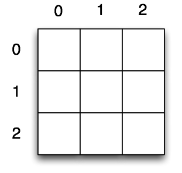

# Aufgabe 1
>nach Variablen

## _a)_

Schreibe ein kleines Programm, das mit der Mitternachtsformel die Nullstellen von `x^2 - 3x + 2 = 0` berechnet.

Die Wurzel einer Zahl kannst du berechnen indem du `Math.sqrt(zahl)` schreibst. Beachte das dabei alle deine Variablen vom Typ `double` sein sollten!

Du kannst folgenden Anfang dafür verwenden:


```
public static void main(String[] args) {
    double a;
    double b;
    double c;
    double ergebnis1;
    double ergebnis2;


    System.out.println("Erstes Ergebnis: ");
    System.out.println("Zweites Ergebnis: ");
}
```

## _b)_

Erweitere dein Programm so, dass du auf der Konsole a, b und c selbst eingeben kannst.

Du kannst dafür verwenden:

```
public static void main(String[] args) {
    Scanner input = new Scanner(System.in);

    double a = input.nextInt();
    double b = input.nextInt();
    double c; //TODO
```

Außerdem musst du jetzt noch einen import machen. Das heißt oben unter die Zeile mit `package ...` muss noch: `import java.util.Scanner;`

Damit sagen wir unserem Javaprogramm, dass wir die Klasse Scanner verwenden wollen.

Mit `input.nextInt()` sagst du dem Computer das die nächste Zahl die auf der Konsole eingegeben wird zu dieser Variable wird.


# Aufgabe 2
>nach if else

Jetzt fangen wir mit unserem Tic Tac Toe Spiel an. Ich habe schon viel von diesem Programm vorbereitet, ihr müsst es nur noch fertig schreiben.

Zuerst müssen wir einige Programmausgaben schreiben.

## _a)_  
Ein Spieler hat einen Spielzug gemacht, als nächstes ist der andere dran. Ergänze den Code in der main-Funktion um eine if else Bedingung.

## _b)_  
Gebt den Inhalt der 9 Zellen des Spiels aus. Die Funktion `zelleZeichnen(int spieler)` wird von `spielfeldZeichnen()` 9 mal aufgerufen. Sie soll dann jeweils je nachdem was der spieler ist eine Ausgabe machen:

spieler|Ausgabe
-|-
KREUZ| X
KREIS| 0
LEER|

# Aufgabe 3
> nach while

## _a)_

In `private static void spielzug(int spieler) { ... }` fehlt eine Schleife.
Der Programmteil soll solange wiederholt werden, bis der Spieler einen gültigen Zug gemacht hat. Verwendet dazu die Variable `allesOK`. Ihr könnt entweder eine while oder eine do-while Schleife verwenden.

Euer Programmcode muss dahin wo die TODO's stehen.

## _b)_

Hier muss eine Fehlermeldung ergänzt werden.

# Aufgabe 4
> nach Arrays


Versuche zuerst die beiden for-Schleifen zu verstehen.



Wir gehen zuerst durch die erste Reihe, dann die zweite und dann die dritte.

Wir wollen klären ob gerade ein Unentschieden ist. Ein Unentschieden ist dann, wenn alle Felder voll sind, aber keiner gewonnen hat. Dieser Teil des Programms wird aufgerufen, wenn wir schon geklärt haben, dass keiner gewonnen hat.

Die Idee ist: Sobald du ein leeres Feld gefunden hast, kann es kein Unentschieden sein. Du kannst also `return false` schreiben. Weil du `return` geschrieben hast, wird die Funktion sofort verlassen und der Rest gar nicht mehr ausgeführt.

Wenn du durch alle Felder durch bist, aber kein leeres gefunden hast, dann muss es ein Unentschieden sein. Deswegen steht da `return true`.


# Weitere Aufgaben

 * Eingabe umbauen:

```
 1 | 2 | 3
----------
 4 | 5 | 6
----------
 7 | 8 | 9
```

* Unentschieden falls keiner mehr gewinnen kann
