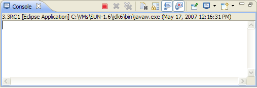
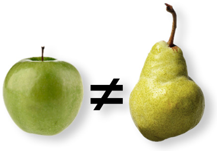

# Tic Tac Toe programmieren

```
 0 | X | X
-----------
   | 0 |   
-----------
   | X | 0
```




**Ein paar Worte vorne weg: Ich erklär euch heute ganz viele Programmiersachen. Deswegen kann ich nicht überall ins Detail gehen. Manches ist so kompliziert, dass ich etwas Abkürzen und Vereinfachen muss.  
2 Bitten:  
1) Bitte sagt mir wenn ihr mich nicht versteht. Wenn ihr 3 Mal nachfragen müsst, dann seit ihr nicht zu blöd das zu verstehen, sondern ich zu blöd das zu erklären!  
2) Habt Spaß!**

## Vorbereitungen
 * Eclipse verwenden
 * Gemeinsam Projekt anlegen

> Datei > Neu > Java Projekt > Projektnamen eingeben > Finish

> Im Package Exlporer den Ordner ausklappen > Rechtsklick auf src > New > Class

> Name eingeben > Haken bei public static void main setzen > Finish

 * "Hello World" programmieren


 ```
package schule.tictactoe;

class Main {

    public static void main(String[] args) {
        System.out.println("I bims, Java!");
    }

}
 ```

## Grundlagen

### Syntax

* Ende der Zeile immer `;` außer wir verwenden `{ }`
* `{ }` umschließt einen Codeblock

### Eingabe und Ausgabe auf der Console

* System.in  
* System.out

### Variablen
* Die Typen int, String, boolean
* Variablen Vergleich
* keine Äpfel mit Birnen vergleichen



> siehe Variablen und Datentypen


### Kontrollstrukturen

#### 1. if
```
int zahl = 5;
if (zahl > 0) {
    System.out.println("Die Bedingung ist wahr! Zahl größer 0.");
}
```

#### 2. else
```
int zahl = 5;
if (zahl > 0) {
    System.out.println("Die Bedingung ist wahr! Zahl größer 0.");
} else {
    System.out.println("Die Bedingung ist nicht wahr! Zahl kleiner oder gleich 0.")
}
```

#### 3. if else if
```
int zahl = 5;
if (zahl > 0) {
    System.out.println("Die erste Bedingung ist wahr! Zahl größer 0.");
} else if (zahl == 0){
    System.out.println("Die zweite Bedingung ist wahr! Zahl gleich 0.")
} else {
    System.out.println("Keine Bedingung ist wahr! Zahl kleiner 0.")
}
```

#### 4. Mehr Bedingungen

Wir können `!`, `||`, `&&` und Runden Klammern `()` in den if-Bedingungen verwenden.

* `!` bedeutet "nicht"
* `||` bedeutet "oder". Im Gegensatz zum Sprachgebrauch aber nicht "entweder oder", sondern "und oder".
* `&&` bedeutet "und".
* `()` kann wie in Mathe als Klammerung verstanden werden.


### Schleifen

#### 1. while-Schleife
```
int zahl = 0;
while (zahl < 5) {
    System.out.println("Zahl kleiner 5.");
    System.out.println("Zahl ist: " + zahl);
    zahl = zahl +1;
    //lässt sich auch als zahl++ schreiben
}
```

#### 2. do...while-Schleife

```
Scanner in = new Scanner(System.in);
boolean allesOK = true;
do {
    System.out.println("Gib eine Zahl größer 0 ein:");
    int zahl = in.nextInt();
    if (zahl <= 0) {
        allesOK = false;
    } else {
        System.out.println("Zahl ist: " + zahl);
    }
} while (allesOK);

```

#### 3. for-Schleife

```
for (int i = 0; i < 3; i++) {
    System.out.println("Zahl ist: " + i);
}
```

### Arrays (Felder)

```
int[][] board = new int[3][3];
for (int row = 0; row < 3; row++) {
    for (int col = 0; col < 3; col++) {
        board[row][col] = 0;
    }
}
```

### Eigene Funktionen schreiben

```
package schule.tictactoe;

class Main {

   public static void main(String[] args) {
       halloSagen();
       int ergebnis;
       ergebnis = addiere(3, 5);
       System.out.println("Ergebnis ist: " + ergebnis);
   }

   private static void halloSagen() {
       System.out.println("I bims, Java!");
   }

   private static int addiere(int zahl1, int zahl2) {
       return zahl1 + zahl2;
   }

}
```
